# X-PatentSAR architecture

Product releases follow the merged-PR numbering policy. `contracts.py` is the only authority for product, pipeline,
ruleset, artifact and cache versions. The source-led pipeline contract is
`patentsar.structure-led`3.0.0; the accuracy ruleset is2.1.1. These internal
epochs are not product releases and do not retag old results as current.

## One workflow

### Independent, user-started SAR domain

Interactive presentation uses the already installed RDKit backend and current
strict reference matcher; Ketcher remains the one correction editor. Region
hotspots bind original draw coordinates/immutable atom indices. Clicking a region
selects its recorded fragment series, and explicit transformation preview compares
actual reference/candidate graphs and selected-context measurements. The small
`study_preview.py` read projection revalidates input/graph/member identities and
reuses conservative context/value comparison; no second SAR algorithm or model
service is introduced. New preview DTOs are isolated in `preview_models.py` so
visual work does not invalidate scientific checkpoints. Raw/provenance detail is
available on demand; missing/failed/stale states remain explicit.

Engine3 adds one prepared `DistributionContext` per exact selected context;
every source-ID population is a disjoint partition while raw repeat observations
remain intact. All group charts reuse its ordered numeric domain. Publication
checks source context identity, row/group completeness and count conservation;
the browser validates the additive partition contract without fetching all rows
into the overview. Old reports keep legacy counting semantics and byte receipts.
`study_conditions.py` owns explicitly source-anchored missing-field declarations,
validated at admission and native input loading. They never mutate observations,
replace units/known fields or change source QA. Candidate eligibility may use a
complete `source_declared` context, visibly distinct from recorded/automatically
verified evidence. Dataset/report QA metadata is additive; absent legacy metadata
is unknown. Passive HTML figures reuse immutable RDKit drawings and recorded bins,
with escaped content, no scripts/network dependencies and a32MiB complete bound.

`web/sar` owns one separate versioned private dataset/region/job/result store;
`core/sar` owns deterministic complete-fixed-graph and observation comparison.
`#/sar` is a separate workbench with explicit project-snapshot or CSV inputs.
It is not an extraction stage, automatic research tail, replacement Lead cache,
new PDF parser, permanent model service or separate HTTP application.
Project snapshots consume the existing effective correction/recognition view
under current visibility and source-CAS checks. Original IDs/graphs/measurements,
source document identity and review limitations remain unchanged. Imported data
is marked imported, not recertified as patent measurements.

Each region binds exact immutable Molfile bytes/atom order and dataset revision.
One bounded exact induced fixed-graph matcher validates the full complementary
graph, mapped cut endpoints, bond types, fragments and transported stereo parity;
multiple region explanations/unsupported encodings/search limits remain explicit.
Reference parsing is reused within a worker, not a second relaxed batch algorithm.
Raw scalar/censored/interval/ordinal comparisons preserve observations and refuse
incomparable known context/units; explicit missing-condition assertions are
separately labelled. There is no unknown-grade midpoint or model-derived reading.

An event-driven SAR-only queue reuses the existing owned bounded subprocess and
analysis lease. Durable worker identity is published before any input handoff.
One model-free CPU child uses 512MiB RSS/180s; immutable 25-pair chunks bind the
whole input and actual algorithm/RDKit identity. Resume is explicit and requires
verified old-worker absence, unchanged input/engine/current source and full cache
validation. Complete publication accounts for every candidate; original/core
acceptance is independent. A SAR startup/store fault makes this module unavailable,
not the original PDF workflow. SAR database/report/engine versions are independent
constants in `contracts.py`; product PR labels do not change core scientific epochs.

The optional full study is another view of this same explicit SAR job family,
not another queue/database/process service or an automatic extraction stage.
`study_models.py` owns the additive request/profile/report contract; `admission.py`
owns nonce/cleanup/input publication for both reference and full-study jobs.
`study_admission.py` selects exact condition identities and named immutable
variable/core definitions. `workers/study_*` run only inside the existing SAR
carrier, with bounded resumable calculations and strict comparison chunks.
`study_publication.py` checks every source row and region/candidate pair before
the complete-result transaction stores a report receipt. `study_results.py`
verifies the exact report bytes and applies whole-dataset filters before paging.

The report contains exact-context activity distributions, descriptive Murcko or
user-confirmed core groups, transparent research candidate comparisons, named
region fragment distributions and a natural-original-ID molecule table. Fragment
identity retains mapped fixed attachment ports; region ambiguity is never resolved
by taking the first embedding. No-variation regions remain visible. A region
defines one independent fixed background; its edges are not independent repeats.
Measured grades/intervals/scalars, computed properties and provided predictions
stay separate. Five descriptors reuse `descriptor_fields.compute_descriptors`;
explicit manual nulls and out-of-domain computation remain unknown. SAR never
loads ADMET/OCSR or substitutes a prediction for patent evidence.

The study candidate policy is explicit strict-context Pareto/evidence/diversity
prioritization for a user-selected experimental objective. It is not the author's
private score or the default post-extraction Lead policy. Same-grade ties are
preserved and incomplete risk data is not safety. The original Lead cache is not
read/written as an alternative SAR acceptance path. Report exports retain all
rows and conditions; SDF contains only eligible complete structures, with all
excluded rows still present in CSV/JSON. Private snapshots and original edits
remain immutable. Database schema2 is unchanged; old single-reference reports
remain readable, while a changed scientific-engine hash requires a new run.

```mermaid
flowchart LR
    I[Original PDF and SHA] --> C[Classify and shared OCR observations]
    C --> L[Locate all evidence-backed structure pages]
    L --> S[Segment original structures]
    S --> B[Prove printed identifier and crop ownership]
    C --> A[Extract original activity cells and text]
    B --> J[Left join by compound identifier]
    A --> J
    J --> O[One uniform OCSR and source/chemistry QC]
    O --> F[Complete source-led workbook and SDF]
    F --> Q[Strict deterministic QA]
    Q --> R[Owned research phase after core cleanup]
    R --> D[Five independent RDKit calculations]
    D --> M[Pinned LogS model inference]
    M --> P[Bounded project-wide Lead prioritization]
    P --> W[PDF and editable table]
```

The formal CLI executes **classify → locate → structures → bind → activity →
smiles → final → qa**. There is one stage registry, source catalog, binder and
artifact writer. Activity extraction follows source binding, using the same
original/OCR observations rather than reparsing the PDF with another engine.
The diagram's branches are dependencies, not competing execution pipelines.

The Web queue owns one extraction carrier, verifies its cleanup, then owns one
research carrier. The UI consumes the same persisted facts. It neither extracts
chemistry nor synthesizes success, progress, properties or missing provenance.

The primary OCSR SDK stays DECIMER. After reaping its child, a single CPU-only
MolScribe worker may inspect at most eight `stereochemistry_not_retained` items.
The candidate must have the exact same non-stereo atom/bond/isotope/charge/
fragment graph, restore all raw stereo markup and preserve all previously
retained stereo across bounded atom mappings. Current source screening and a
recomputed proof are mandatory for formal/research consumers. Wave/unknown
source symbols, graph changes, ambiguity or bounded validation failure remain
review, not guessed parity. No string editing, parallel model ensemble, normal
result replacement or external LLM call is involved. This pass and its weights
are part of the same complete environment setup, never a manual extra install.
Source-evidence epoch3 invalidates derived SMILES/QA/projections independently;
the original OCR, five upstream stages and content-bound raw model observations
remain reusable. Historical results are not retagged as current.

## Completeness and accuracy

Classifier epoch2 ignores prose examples and cover ISR boilerplate as section
boundaries. Binder epoch8 parses exact paragraph-prefixed synthesis headings;
a standalone diagram needs a freshly observed original heading, unique geometry
before the first procedure, and original/crop fingerprints. Wide/reordered grids
carry literal header-role proof, not adjacency or a fixed number of columns.
Activity epoch7 owns every physical column losslessly, retaining multiline raw
headers and distinct duplicate/unknown fields. Upright table OCR prevents per-token
digit inversion; independent clipped-cell observations can prove ownership despite
a padded detector box. Unknown/conflicting meaningful values remain rejected.

The optional LLM path has one API policy, quota, cache and HTTP carrier. User-owned
`llm.local.yaml` is the editable authority; authenticated settings expose only
redacted metadata. Public HTTPS endpoints, connection-time DNS/IP checks, TLS,
no redirects/proxies and explicit consent prevent local model/API disclosure
fallbacks. Three small wire adapters support compatible Chat Completions,
Anthropic Messages and Gemini GenerateContent; no provider SDK/model is installed.

At an otherwise unparsed activity header, pure core validators construct literal
ID-column candidates from complete original geometry, known metric/unit/value
columns and unique printed IDs in the existing proved catalog. The API selects
one existing role or abstains; exact references and the full original matrix are
rechecked before the same cell parser/writer continues. No ID/value/unit/graph is
generated. Unsupported/ambiguous evidence remains rejected. Normal rule parsing
never invokes this fallback. The optional post-activity column review and final
source-led findings review share the same interface, without acceptance authority.
The old whole-page VLM/free-form QA/batch client paths are removed, not kept as
competing implementations. Heading-owner remains a candidate protocol, not an
automatic binding approval or all-format guarantee.

Each new job captures an immutable private API policy under `workspace/llm`; a
resume carries the same context identity, quota and 24-hour content-bound cache.
GUI-managed context v2 stores a credential fingerprint/reference, not another
key copy; operator ENV profiles and preserved v1 records retain their explicit
private boundary. Credential-only renewal is an authenticated, consented, idle
job operation under configuration and budget locks. It retains the exact original,
profile, immutable policy and spent quota; no inference or automatic resume occurs.
Every network attempt reserves durable quota before sending. A separate private
disclosure check follows reservation. GUI settings publication and the bounded
private-input/EOF handoff to the owned carrier share a directory lease; it ends
before waiting for a network response. Work already handed off is in-flight and
cannot be unsent; OFF prevents later handoffs and downstream proposal use. Renewal
rechecks faults/quota under the budget lock, never clearing non-authentication
safety blocks or transient cooldowns. Standalone CLI stages inherit one invocation
identity, so a missing Web launcher cannot reopen a failed circuit.
A separate private budget lock protects serial consumption across processes; corrupt/foreign state
cannot reset it. Changes apply to future new jobs, not silently to active/resumed
work. Default OFF makes no request; original evidence, chemistry and strict QA
remain authoritative. API/OOM/infrastructure failures never enter an escalation
loop. No whole-PDF upload, numerical repair, local LLM or extra artifact writer is
introduced; model/API correctness still requires consented real-provider testing.

The same client validates evidence content before caching and on cache hits;
namespace identity includes the consumer validation contract. Rejected entries
are removed only by key plus observed content, never a concurrent replacement.
Ordinary SQLite lock/storage faults are explicit optional-cache observations;
unsafe ownership, permissions, links and corruption remain rejection. One safe
wire failure type preserves status and bounded Retry-After without provider bodies.
Job health v2 serializes authentication blocks and transient faults under the
same logical budget. One active attempt never restarts later API requests after
a transient fault; only a later explicit attempt after cooling may retry. OFF,
revocation, quota exhaustion and carrier/cleanup faults cannot become retries.

Activity coverage v1 inventories coordinate grids, declared text regions and
otherwise uncovered classified seeds independently of returned rows. Unsupported
headers and recognized regions without original rows remain unresolved, even if
other tables succeeded. Only the existing writer publishes the additive proof;
activity epoch7 invalidates old derived stage reuse, while unchanged upstream and
compatible raw observations remain reusable. QA v4 rejects missing/unresolved
coverage. The read model rechecks only cached acceptance after a QA-schema change,
preserving raw rows, source IDs, corrections and old producer artifacts. Optional
repair counters are observations, not estimates or another acceptance authority.

- Printed identifiers and original spatial evidence define the compound
  universe. Activity membership never determines whether a proved structure
  receives recognition, descriptors, visualization or correction support.
- Original grid cells, captions and explicit synthesis headings are ownership
  evidence. Sequence, numerical proximity, molecular similarity or assay
  presence cannot fabricate an identifier or change42 to4-2.
- Binder epoch8 discovers numbered grids across all selected structure-source
  pages. Empty or partial classifier/locator table hints cannot exclude a
  proved original cell; only actually recognized grids are reported as table
  ownership. Headerless adjacent continuations retain independent ID evidence.
  An unused pair requires blank original pixels in both cells and no segment
  evidence. Proved selected reprints can retain multiple additional sources
  for one confirmed primary ID; novel or conflicting primary IDs stay withheld.
- Activity epoch7 treats classified pages as seeds, not a complete table
  inventory. Only a proven table can inspect its immediately adjacent next
  page; missing grids, changed geometry or unrelated captions stop carry-over.
  An empty seed set never triggers an all-document OCR scan.
- Missing activity is legitimate only with explicit classified-page coverage
  evidence. A declared activity page with lost/malformed rows is a failure.
- The existing `compound_catalog` is the sole independent numbered-source
  authority. Confirmed catalog entries form the formal binding set. Proved
  reprints become additional sources, not duplicate anonymous compounds.
  Unproved/conflicting numbered or unnumbered candidates remain visible for
  review; they do not become guessed accepted chemistry.
- Each metric keeps original page/table/cell evidence. Repeated observations,
  units, assay contexts, suffixes and censored values are not collapsed.
  Unknown headers/units remain unknown. Table numbers are provenance only,
  never a lookup for targets, endpoints, units or ID repairs.
- Crop-save failure is explicit segmentation failure. A page image is never a
  replacement molecular input. Missing crops are not located by searching for
  similarly named files in unrelated directories.
- All confirmed numbered structures use the same source stereo screening,
  raw model provenance, RDKit/query/element QC and final QA. No-activity rows do
  not get weaker validation. Human edits preserve isotope, charge, fragments,
  salts and stereochemistry, with audited source/revision checks.
- RDKit validity and model token confidence do **not** prove exact original
  atom/bond/stereo agreement. Wavy/unknown bond conflicts remain unresolved,
  not converted into definite R/S or racemates. Scientific model evaluation is
  separate from passing application contracts.

Strict scientific errors remain rejected and are collected through the
completed formal QA. Technical failures, unsafe source identity and malformed
inputs stop processing. A fully executed, current QA-rejected run may finish
research enrichment for individually qualified records after verified cleanup;
the job remains **failed / core_not_accepted**, not accepted or complete.
Interrupted/incomplete/foreign/old core evidence cannot enter that path.

## Modular responsibilities

Interface localization has one frontend authority in `frontend/src/i18n`:
supported-language/default registry, local browser preference and subscriptions,
and modular application-owned message catalogs. English is the default; Chinese
and English are required, with additional locales added at the same registry/catalog
boundary. Locale changes update React presentation and document language without
remounting workflow, input, correction or drawing state. UI errors retain source
message/parameters for redisplay. Source identifiers, patent headers/text, values,
units, chemistry and user input are not localized. No translation API, backend
setting, scientific epoch, task execution or acceptance authority is added.

| Boundary | Authority |
|---|---|
| CLI orchestration | `application/pipeline.py`, typed `PipelineContext`, one handler per stage |
| Cache/identity | `contracts.py`, `stage_cache.py`, exact original/dependency/content fingerprints |
| Shared PDF/OCR geometry | Page observation cache, original-cell grid/read modules, one bounded OCR engine |
| Activity parsing | Small identity/header/coordinate/text/observation/artifact modules; `activity_extractor.py` is a facade |
| Activity completeness | `activity_coverage.py` inventories original regions/seed coverage; one writer and strict QA consume its bounded proof |
| Source ownership | Spatial cells/captions, source headings, catalog reader and one binding writer |
| Visible labels | `visible_label_cache.py` owns optional raw PDF/crop identity transport; `binding_observations.py` owns validated refinement; fresh native/shared cell/heading observations prove ownership |
| Recognition | One verified printed-DECIMER adapter and bounded JSONL carrier, raw observation cache and source QC |
| Observation completion | `ocsr/observation_completion.py` separates complete source observations from scientific acceptance; standalone default stays strict and the coordinator retains every finding for final QA |
| Final output | Identifier-led structure and activity join; workbook/SDF modules share formal selection |
| Acceptance | One `qa_inputs` context, separate source/file inspections and source/chemistry/output gates; `qa_report` facade never overrides findings |
| Jobs/recovery | Durable queue, kernel identity, owned phase cleanup, immutable history and bounded checkpoint copy |
| Molecular evidence | Generic typed `MolecularObservationStore`, configured prediction/descriptor stores; one source/job protocol |
| Effective values | `property_values.py`; all table filters, sort and CSV use the same resolution |
| Presentation | API-v1 typed DTOs and decoders, slim real workflow, split PDF/table and local Ketcher editor |

Presentation uses the derived patent-owned `identifier_label`, separately from
stable canonical join keys. Exact source labels and audited explicit renames win;
only a proved lexical ID can lose its private `Compound ` wrapper. Unconfirmed
source references keep their uncertainty. One helper drives the table, filters,
copy and export; an unchanged correction label round-trips the original key.
This additive view does not rewrite raw projection or scientific artifacts.
| Environment | One fixed component allowlist, complete setup plan, durable installer and atomic configuration publication |

Activity cell-owned pages cannot reenter the text parser. A generic heading
strategy sees only unclaimed source labels/crops/pages; it cannot override
original cell ownership. Removed activity-led filters and fixed table/target
parsers are not retained as alternative production paths.

Visible-label observations use epoch8 and require the actual original PDF SHA-256,
crop SHA-256 and exact page/box identity. Missing/foreign/incomplete cache entries
cannot supply identifiers. Publication is atomic; an unavailable existing OCR
provider is selected by the shared page authority, not a private batch fallback. The removed completion module
and unreferenced private helpers/crop producer are not alternate binding paths.

## Five calculations and one prediction

MW, LogP, TPSA, HBD and HBA are real RDKit calculations. They run before model
loading and are published independently with current source SHA, canonical
isomeric graph SHA, actual RDKit version, algorithm epoch, producer and time.
LogS uses the pinned ADMET-AI2.0.1 CPU ensemble and its verified complete model
inventory. Ensemble members/outputs are not silently pruned for speed.

Effective values, everywhere:

1. Valid current manual override, **including explicit null**.
2. Complete current independent descriptors for the first five keys.
3. Compatible complete current ADMET observations; LogS requires this model
   evidence or an explicit valid manual value.

Noncomplete/stale/failed packets expose no old values. LogS failure cannot erase
completed calculations, and descriptor success cannot turn a failed whole job
into success. Reads/filters do not compute properties or start a model.
Raw evidence, overrides and CSV calculation/model provenance remain separate.
Graph/source changes invalidate old observations. Coordinate-only edits do not
invoke recognition or inference; actual graph changes target only that compound.

## Lead nomination, not scientific acceptance

Policy v2 treats model risk continuously (core safety combines mean and worst
endpoint protection), not as an experimental veto. Probability >=0.8 requires
explicit `risk_review_required` and an amber candidate marker, preserving raw
predictions and strict source/graph/full-evidence gates. This generic research
policy does not grant safety, experimental validation or clinical advancement.

The same research worker selects target-eight candidates after model cleanup.
Pure activity/chemistry/scoring modules separate exact-context percentiles and
coverage, validated ADMET probabilities, soft physicochemical preferences,
source quality and bounded Morgan/Tanimoto/scaffold diversity. No full pairwise
matrix, external LLM, patent-specific list or second model exists. Unknown,
censored or conflicting activity and unsupported chemistry remain explicit;
no-activity rows retain their normal structure/property workflow but cannot
supply invented efficacy. Small or insufficient pools are not padded.

`lead_endpoints.py` selects eleven reviewed probabilities from the already
verified ADMET response, never clamps inappropriate regressions. Legacy
six-field packets remain readable; the normal worker supplements them through
the existing content/model-bound cache before nomination. `lead_storage.py`
owns one additive rebuildable project packet in workspace SQLite v1. Effective
input fingerprints and source-revision CAS prevent stale/partial publication.
Original chemistry, corrections and QA are unchanged. All effective table,
filter, copy and export consumers use this same assessment before paging/global
filtering. GET never selects leads or starts inference. Audited value edits
re-evaluate only this lightweight tail; graph edits retain the existing targeted
worker, then re-evaluate the whole pool. Changed evidence marks old selections
stale. Job completion independently checks full current pool/producer evidence.

Nomination is a research heuristic, not experimental Lead validation, safety,
selectivity, PK, synthetic feasibility or an applicability-domain proof.
Scores and missing evidence are preserved. The formal eight-stage
QA and API v1 remain unchanged. Research progress uses
`admet.progress.phase="lead"`, not a competing formal stage registry.

## Resource lifecycle

- One task owns its active heavy phase. Existing analysis lease prevents two
  owned inference consumers; no permanently resident parallel model servers.
- Before loading, bounded admission measures `MemAvailable`. Default model
  headroom is3072MiB, with at most110s waiting; an unavailable measurement or
  expired wait is explicit failure. No other application is stopped. The UI
  shows waiting only from live, owned, recent measured telemetry.
- Segmentation loads one verified model for at most three pending chunks
  (normally30pages, at most60); each completed chunk has its own immutable
  input/dependency checkpoint. A failed later chunk retains successful earlier
  chunks. The next window uses a fresh process, with no overlapping model.
  Internal window control v2 passes owned bounded fingerprint files. The worker
  verifies unchanged original/dependencies and seals each successful batch
  immediately using the sole manifest authority; the parent only verifies.
  Checkpoint transport follows the same `CORE_STAGE_ORDER`, not artifact-map
  declaration order. Unsealed old metadata is never retroactively approved.
- DECIMER recognition is serial with bounded preparation and an exact-image /
  exact-model raw cache. Healthy workers recycle after100observations or900s.
  Consecutive infrastructure starts are bounded; exhaustion aborts the batch
  rather than labeling every remaining molecule a recognition failure.
- ADMET reuses one task-owned CPU model for at most five50-molecule requests or
 150s between requests. Request JSON, stdout/stderr, owned descendants, RSS,
  CPU and wall time are bounded. Cleanup is verified before recycling or
  release; unverified ownership prevents further inference.
- Per-stage lifetimes are bounded by actual work and the queue's global task
  deadline. Cancellation, shutdown and resource waiting never enable unlimited
  retries, alternative recognizers, fabricated outputs or relaxed QA.

## Storage, restart and deployment

Recoverable history deletion is a separate presentation/lifecycle authority,
not scientific acceptance or filesystem garbage collection. Additive private
tombstones retain original projects, jobs, audit and producer/checkpoint evidence.
Normal list/read/write routes exclude removed entities; writer-side visibility
checks and the existing analysis lease protect enqueue/edit/direct-model races.
Public task visibility is distinct from internal immutable provenance: removing
a producer record must neither erase properties nor promote failed core QA.
Project removal includes its children in daily views; restoration does not undo
individually removed children. Only software-owned saved export files below
registered result roots are discoverable, without arbitrary path input, symlink
following, whole-tree scans or model calls. Terminal environment history removal
never uninstalls components or changes current verification/configuration.
The recovery UI is explicit that files remain on disk; no purge, retention timer
or hidden competing deletion path is added. API v1 remains unchanged; product releases follow the PR policy.

The existing revisioned environment-settings transaction also owns upload and
result locations. Additive private `file_settings`/`file_roots` tables in its
existing SQLite v1 retain current destinations and bounded historical roots;
there is no second settings endpoint/database or automatic relocation. Native
data prefixes have workspace/purpose markers, private ownership, write probes,
no-link access and non-overlap checks. Reads never initialize location state.
Legacy uploads/runs remain valid; external originals resolve only through recorded
upload roots, and attempts through recorded result roots. New immutable run specs
carry explicit `workspace_root`, so ADMET cannot infer state from a result path.
New exports reuse the existing byte iterator once, saving bounded atomic copies
under the selected result root before serving those exact bytes to the browser.
Browser download destinations remain browser-owned. Active tasks retain their
recorded paths; future requests read the new settings without a service restart.

All local installation/source/model/cache/state/evidence storage belongs on
E, physically under `E:\WSL` or its registered E-drive VHDX. Native paths live
under `/srv/wsl`; the C-drive Ubuntu and unrelated apps are protected.
Windows launchers are in `E:\WSL\apps\x-patentsar`. Actual runtimes remain
isolated: CPython3.12 application/RDKit, CPython3.10 DECIMER/TensorFlow and
CPython3.12 ADMET CPU. Configuration, not duplicate source code, selects paths.

The original PDF SHA and owned attempt directory bind every run. Resume creates
a fresh private attempt, copies only verified bounded checkpoints/raw
observations and leaves old outputs/QA/audits/history unchanged. Changed
pipeline/ruleset epochs require a new run; compatible raw OCR observations may
be reused, never old derived acceptance. Histories retain their recorded stage
order; missing old order is unknown, not rewritten as the latest chain.
Raw OCR compatibility checks the explicit supported producer allowlist rather
than equality with the new derived-pipeline epoch. Original SHA, byte size,
page count, raw schema/observation format and supported rules remain required.
Unknown producers are rejected and the source cache is never rewritten.

One complete environment action owns the default PDF→table→six-property
dependencies, including ADMET runtime and weights. It rechecks installed
components, installs only deficiencies after download/license consent and
activates configuration only after verification. GET/readiness is not an
installer; probe errors are not proof of missing content. WSL/application
bootstrap, GPU and clean-machine scientific acceptance remain separate gates.

Release requires focused changed-behavior/consumer tests, reviewed commits,
merged main, a clean exact-main wheel and asset audit, idle/checkpoint-safe
application deployment, installed-byte/runtime identity, API and Chrome smoke
checks. Keep the previous wheel/config/state rollback; never restore a database
over a newer live task. Product release numbering follows the PR policy. Implementation, integration,
deployment and real scientific acceptance are distinct evidence states.

Endpoint/DTO details belong only in [WEB_API.md](WEB_API.md); installation,
recovery and deployment procedures belong in [OPERATIONS.md](OPERATIONS.md).
