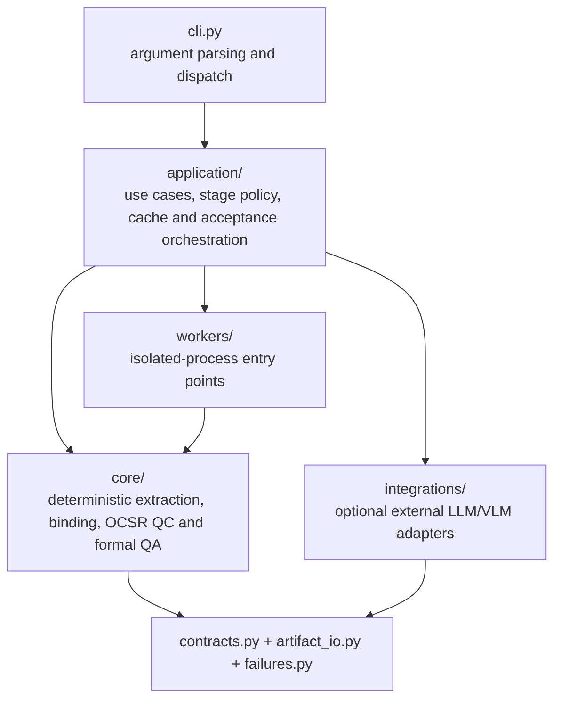
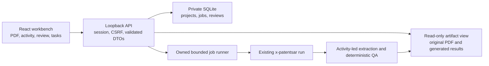
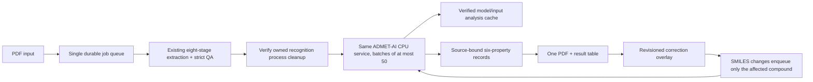
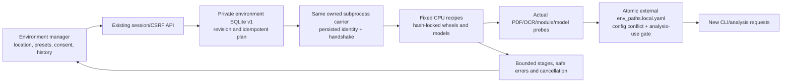

# Architecture

## Product boundary

X-PatentSAR is a standalone Linux/WSL application. Its command-line boundary is `x-patentsar` plus documented filesystem inputs, configuration and outputs. It has no runtime dependency on Synon processes, APIs, plugin registries or user workspaces. The new Web presentation layer uses the same application/CLI pipeline; it does not add another extraction engine.

Only `x-patentsar run` produces a formal activity-led result. Commands labelled as diagnostic may inspect or generate intermediate material, but their outputs cannot satisfy formal binding, SMILES or QA gates. Manual Web reviews and corrections are separately persisted annotations/overlays and cannot change generated extraction artifacts or formal acceptance.

## Layer ownership



Dependency direction is enforced by tests: `core/` does not import `application/`, `integrations/`, or the removed `orchestration/` package. External model configuration and HTTP calls live under `integrations/`; the CLI contains presentation logic only.

```text
src/patent_sar_extractor/
  cli.py                   command-line presentation
  application/             typed stage registry, use cases and acceptance policies
    pipeline.py             sole ordered extraction coordinator
    pipeline_context.py     explicit data exchanged by the eight stage handlers
    stage_*.py              one handler per stage; stage_cache owns fingerprints
  core/                    deterministic domain and extraction engines
    series_table_binding.py typed I-series geometry/evidence resolution
    structure_binder.py     source-ownership coordinator and one artifact writer
    binding_*.py            geometry, observations, candidates and strict arbitration
    ocsr/                   DECIMER-only recognition, cache and RDKit QC
  integrations/llm/        optional LLM advisory QA and VLM adapter
  workers/                 isolated Python-process entry points
  defaults/                immutable packaged configuration
  contracts.py             product, pipeline, ruleset and schema authority
  artifact_io.py           atomic JSON read/write boundary
  failures.py              single strict-failure marker authority
  smiles_artifact.py       canonical SMILES artifact envelope
```

## Web presentation and state



The UI never reads local paths directly or runs extraction code. The API validates
uploaded originals, renders bounded pages and reads canonical artifact identity
envelopes. Jobs invoke the existing CLI in one owned process group. SQLite review
annotations are separate from extraction artifacts; there is no manual path to
change binding/SMILES/QA files or declare a failed run formally accepted.

`frontend/dist` is build output. The controller-owned packaging tool verifies and
copies it into the wheel's private package static directory. The installed wheel
serves both UI and API from one origin; Node.js is a build dependency only.

The row correction dialog is the only editing path: numbered identity, a local
Ketcher Standalone 3.18.0 drawing frame, activity values and six property inputs.
There is no separate editor server or duplicate review dialog. The lazy
`ketcher.html` entry isolates vendor CSS/portals; its same-origin, window-bound,
bounded message protocol is split from a single debounced export subscription.
One V3000 export is parsed by the same authenticated local MDL authority used for
corrections. The vendor SMILES getter is not trusted: it can assign parity despite
a wavy bond. The bounded conversion route has no model, queue or persistence.
Explicit unknown MDL governs its unspecified start atom, including native writers'
redundant parity/ABS membership; exact source text remains retained. Timeouts fail visibly and
require explicit reload; closing unsubscribes, with no polling/export producer.
No molecule is sent to an external host. Indigo worker/WASM ship in the same
wheel with third-party notices, loaded only when editing.

The workspace/API retain no-eval/no-embed CSP. Only the editor document and
its owned worker permit WASM compilation; JavaScript unsafe-eval remains
forbidden. Paper core excludes the unused PaperScript runtime compiler.

The default workspace is PDF on the left and one table on the right. It has no
permanent sidebar or standalone molecule-analysis workspace. The table combines
original activity observations with six compact source-bound properties: MW, LogP,
TPSA, HBD, HBA and predicted LogS. The first five are computed descriptors, not
patent measurements. Missing/failed/stale values are never filled with guesses.
Each activity retains its assay, unit and independent original source navigation.
`web/activity_columns.py` collects one bounded project-wide column catalog during
the existing effective-row scan, before filtering or pagination. Exact
name/unit/target/assay tuples receive stable content IDs; no unit normalization,
assay merging or extra database/PDF reads are introduced. The frontend maps every
observation to that exact context, preserves repeated values and independent
sources, and renders one column per context instead of a stacked activity summary.
Headers, structure identity and the correction control remain fixed during native
horizontal scrolling; explicit column widths share the existing resize handler.
Every column can be hidden/restored, with sticky offsets recalculated from visible
identity columns. Header menus submit bounded column IDs/operators to the same
`ResultQueries` path. `table_query_models.py` validates at most 20 conditions in
16 KiB, `table_query_values.py` is the single accessor, and `table_queries.py`
filters/sorts the complete effective project before pagination. Multivalued
activity filters match any original observation; sort uses the first, never a
best value/average. Stored current property predictions are read only when needed;
querying never invokes inference. Up to 200 stable full-project activity choices
and counts are collected in the existing scan; an excessive vocabulary exposes
its truncation and still supports textual filters. Export uses the same selectors.
The URL owns valid query state; the UI can recover empty/error/all-hidden states.
Plain TSV copies current-page selected/all rows and visible columns only, with
spreadsheet formula protection. There is no competing page-local sort/filter,
formula engine, second grid library or direct edit of source/QA fields.
The same bounded catalog scan owns project-wide activity rank histograms before
any filter or pagination. `activity_rank_values.py` parses only exact finite scalars
and supported ordinal/convention directions; `activity_ranking.py` selects tied
value boundaries nearest cumulative thirds. A shared 50,000-distinct-score budget
bounds extra memory; mixed/unknown/over-limit scales remain explicitly uncolored,
never dropping measurements. `activity_rank_models.py` adds API-v1 presentation
metadata. Only visible results receive aligned rank values; empty raw fields are
excluded from serialization, preserving artifacts, exports and source fingerprints.
The frontend consumes those scores/cutoffs, not current-page quantiles. Repeated
observations remain separate; online corrections update the same full-project scan.
No SQL/PDF/model calls, database migration, scientific acceptance change, persistent
ranking store or competing frontend calculation is introduced. Green/light-green
are within-column browsing aids, not absolute potency or confidence statements.
`web/activity_provenance.py` is the shared bounded source-cell/context parser for
artifact projection and value focus. The previous inline parser is removed.
Visible results add opaque `activity_source_keys`, bound to raw source fingerprint,
current correction and observation index/scalar. Empty raw keys are excluded from
serialization, so original payloads, correction fingerprints and exports do not change.
The existing page GET accepts a selected compound/key; `web/activity_focus.py`
checks current ownership/context/value and projects only actual matching metric
cells into the original rendered page coordinates. No new OCR/model, text-search
heuristic, whole-table highlight, result projection epoch or SQLite schema is added.
Unknown rotated orientation or missing cell/printed-ID proof is explicit page-only
navigation. Malformed, foreign, stale or out-of-page selections fail, never draw a
plausible box. The same frontend page resource renders the outline and restores it
from a deep link; page/tab/structure changes clear a previous activity selection.
Statistics, binding/QC and manual decisions are available only on demand.
Original crops and bounded RDKit PNGs appear side by side; a redraw is explicitly
not original evidence. Token probabilities are uncalibrated observations, never
chemical-accuracy percentages or manual approvals.

All pages share a neutral white/light-gray/near-black token set and system sans
typography. Upload, recent files, jobs, environment management and dialogs follow
the same minimal interaction hierarchy; details and dangerous-action consent
remain available on demand rather than occupying permanent panels.

### Complete source corpus, not an activity-filtered table

The locator selects evidenced numbered tables and synthesis/caption pages across
the shared original OCR cache, independent of activity membership. Segmentation
uses these complete pages, including a project with zero extracted activities.
There is no active-ID crop region, neighbor padding or unbounded fallback scan.
Formula/claim prose alone cannot establish a numbered structural table.
Locator and segmentation epochs 4 invalidate old activity-filtered checkpoints;
compatible original OCR stays reusable. The formal eight-stage order is unchanged.

`core/binding_catalog.py` builds one printed-ID catalog from confirmed original
cells/captions, without filtering IDs by activity membership. Its nested schema
is governed by `contracts.py`; `binding_artifacts.py` writes and returns it in the
same binding artifact. The original formal activity subset is a consumer view,
not the catalog universe. Proved selected-subset reprints become additional
sources of their primary printed owner. Ambiguous labels, conflicting complete
catalogs and cross-boundary/unproved crops remain withheld. The pairing and proof
code is factored into `numbered_structure_models/pairs`, not duplicated.
Binder epoch 5 invalidates old binding checkpoints while compatible upstream OCR,
segmentation and exact-content OCSR observations remain independently reusable.
Even a zero-activity run builds a source catalog; failure of its original formal
activity scope remains explicit, with only the newly written source projection
available for review. It cannot satisfy QA or create guessed SMILES.

`web/compound_catalog.py` rechecks the produced catalog and unique ID/crop owner
proofs; it does not perform binding. `web/artifacts.py` uses its IDs as primary rows
and left-joins activity observations by canonical ID. Activity-only IDs remain
visible. Proved additional sources are not anonymous duplicate rows.
`web/structure_corpus.py` appends still-unassigned observations with an explicit
`编号待确认` source reference; `record_kind` describes original association as
structure_activity, structure_only or activity_only. Unknown source identifiers
are explicitly internal, not invented printed compound numbers. Counts represent
records/observations, not chemically deduplicated compounds. A missing activity
association is not evidence of inactivity. No unassociated source receives guessed
SMILES, accepted confidence or model values. Missing images are retained as explicit
unavailable evidence rather than silently dropping their rows.

`core/catalog_reader.py` now owns the common bounded source-proof reader used by
both recognition and the Web adapter; the former duplicate Web proof logic is removed.
`core/ocsr/recognition_inputs.py` constructs one batch: the original formal order,
then remaining uniquely proved printed IDs, with no repeated inference for proved
reprints. Source-only images enter the same converter/model/cache and identical
raw-string, RDKit and source-stereo checks, not a fallback/research recognizer.
SMILES v2 stores the two consumer scopes as `records` and `source_records`; the
formal Excel/SDF and QA keep their original ordered association scope. The Web
rechecks exact ID/structure pairs before attaching source results. Rejected source
candidates do not acquire an effective SMILES or six properties. The existing
prediction worker accepts qualified molecules independently of activity membership;
invalid recognition is excluded consistently for both kinds of row.
The recognition fingerprint includes all proved catalog image contents and SMILES
schema v2, so an old activity-only checkpoint cannot falsely report full coverage.
Product v0.1.0, API v1, ruleset 2.0.4 and SQLite v1 remain unchanged. This source
coverage change does not reset the independent ADMET runtime/cache identity.
Original artifacts and audit are not retagged.

The raw projection epoch is `compound-catalog-v1`. Rebuilding it once establishes
a new source nonce; old correction/prediction audit is preserved but becomes stale,
never silently reapplied. Formal binding and deterministic QA still verify
the activity-associated subset; OCSR now also covers the proved catalog. A full-corpus export declares that scope and remains
review-only when it includes unassociated sources.

### Task and analysis boundaries

The task page first uploads and validates an original, then explicitly creates a
durable extraction job. A failed start retains the uploaded project and exposes
recovery; uncertain writes are not blindly replayed. Operator notes are records,
not executable prompts. Intermediate/force options become real CLI flags, while
safe resume retains checkpoints and never repeats force invalidation.

Each new attempt, including resume, receives an independent job-ID output root.
Resume copies only bounded, content-verified upstream checkpoints, relocates
declared image/path fields and preserves raw chemistry/provenance exactly. The
CLI rechecks current fingerprints and strict acceptance; transport is not a second
cache authority. Terminal attempts seal private write-once stage snapshots.
An ordinary rerun also uses this same transport when the latest stopped job's
current-runtime private output and exact PDF observations are verified. It retains
the new request's options and never inherits old history or acceptance. Changed
rules/runtime retain only independently compatible raw OCR; `force` starts fresh.
Legacy jobs sharing a mutable output root report `history_available=false` rather
than inheriting a later run's successful stages. No SQLite migration or in-place
rewrite of old generated artifacts is required.

`smiles/progress.json` atomically publishes actual completed/total, cache hits,
failures, execution device and measured peak RSS. The existing job read path
validates its version and bounded counters; no extra poller, predicted ETA or
guessed success percentage is introduced. Reused checkpoint facts are recorded
explicitly, and cached observations do not pretend to measure current resources.

`web/result_queries.py` owns filtering, reviews, pagination and presentation
coordinates. It validates the original SHA and bounds across filtered rows but
loads PDF pages only for visible-row coordinate transforms. The service remains
the workspace use-case boundary; query logic has no competing implementation.

The molecular analysis integration is a separate research-only consumer of the
same original/crops and validated molecules. DECIMER recognition, RDKit QC and
ADMET-AI CPU model predictions do not rewrite generated pipeline artifacts or
promote formal acceptance. Its rebuildable private cache is independent from
authoritative project/job/review state. Evidence summaries aggregate source
fields and preserve units/censored values; they do not invent model-generated
mechanism or efficacy claims.



### Default page, edits and automatic predictions

`Project.first_structure_page` is the minimum validated original-page source of
an actual structure in the raw result projection. It does not use the first
activity page, current search filter, manual activity edits or a browser default
of page 1. An absent URL page waits for this source; explicit page navigation wins.

Correction documents use a source fingerprint and compare-and-set revision.
Separate additive SQLite-v1 tables store overlays plus append-only audit; source
PDF/geometry, original compound payloads, output roots and core acceptance remain
unchanged. Filtering, redraw and export consume the same effective overlay.
Restoring original fields is another audited revision, not deletion of history.

Exact MDL/SMILES isomeric graphs are validated by `correction_chemistry.py`;
`correction_fields.py` owns old-client preservation, and `property_values.py`
owns effective manual/computed values for filter, sort and export. The raw source,
model observations and append-only correction audit keep separate authorities.
Explicit manual null stays blank; a changed graph clears incompatible old
manual values. Coordinates and unchanged representations retain values.
`correction_recovery.py` keeps strict reads and a PUT-only exact-original
corrupt-addon restoration; CAS/job guards remain before recovery, and enqueue
failure rolls back both correction and audit. Recovery cannot fabricate a
current graph or promote rejected original evidence.

Molecular-graph changes atomically enqueue an ADMET-only attempt in the existing queue.
That attempt must not replace the extraction root, refresh the source projection
or change its nonce. Six-property records are keyed by original source fingerprint,
canonical isomeric graph digest and reviewed prediction epoch.
`prediction_identity.py` is the single bounded digest authority for readers and
writers; a raw legacy digest is accepted only as proof for the exact current
string. It is not migrated or guessed from audits/other rows. Equivalent graphs
retain verified observations without another model call; stereo, isotope,
charge, fragments and original source changes still invalidate different inputs.
Only an exact current,
verified pinned producer can supply completed values. Cancelled/interrupted/missing
or corrupt results remain explicit failures, never successful progress.

Existing projects use the same owned ADMET-only carrier to complete proved
numbered source recognition before properties. `completion_inputs.py` validates
the shared printed-ID catalog and the verified original/crop owner; activity
membership is not an input condition. `completion_worker.py` holds the same
analysis-use lease and uses one core `SmilesConverter`/DECIMER process, closing it
before ADMET. A bounded sanitized copy of raw observations can avoid inference,
but current chemistry/source-stereo QC always runs again. Original artifacts,
raw compound payloads, correction fingerprints and formal QA remain unchanged.

The additive SQLite-v1 `compound_recognitions` table is a rebuildable observation
cache, bound to source fingerprint, crop content SHA, runtime and owned job.
`recognition_storage.py` supplies the same base to table/detail/correction/export
and prediction publication before manual overlays. Explicit manual graphs/blanks
win; value/ID-only edits do not suppress new recognition. Original audit is not
rewritten. Source changes invalidate old completion instead of reusing its values.
The existing progress strip exposes optional `recognition`/`properties` phase;
no new job type, endpoint, engine, poller or dependency is added.

Only actual eligible SMILES enter inference. The ADMET stage records skipped
missing-SMILES sources separately from progress.total; those rows remain visible
with unavailable properties. Zero eligible inputs seal an empty stage with zero
completed/total and no model call, never fabricated predictions. Invalid supplied
SMILES and failed model results still fail; skips cannot hide a failed producer.

ADMET is a separately sealed job-stage fact, not a ninth formal extraction stage.
Core and model processes are sequential and use the same owned carrier and cleanup
rules. Cross-process analysis-use locking prevents competing inference or
environment publication; the SDK remains CPU/bounded/offline. The frontend reuses
the existing job-read polling path, with no extra result-prediction poller.

## Local environment control



`web/environment_specs.py` owns the six allowlisted components and dependencies.
`environment_storage/paths/config/queue` separate persistence, approved storage,
configuration publication and lifecycle. Dedicated worker modules handle fixed
downloads/archives/commands and CPU probes. There is no arbitrary package manager
API or second process-ownership implementation. The metadata GET never imports
scientific SDKs or downloads. Inspection and installation are explicit durable jobs.

`tools/build_environment_resources.py` derives the base-worker requirements from
the sole application `uv.lock` using pinned uv 0.11.31; CI enforces parity. DECIMER
Python 3.10 and ADMET Python 3.12 CPU recipes describe separate scientific runtime
boundaries. Their locks and model fingerprints are packaged text, never model
binaries or user patents. All installations, downloads and state stay external.

Interpreter and model consumers read one external configuration. Every extraction
process captures its configuration at startup, so verified activation cannot
mix environments mid-run. Analysis publication serializes with the existing busy
gate and refreshes future runtime/cache identity. Manual changes and explicit
environment overrides cannot be silently replaced. None of these operations
changes scientific acceptance, original PDFs or generated results.

## Formal data flow

Every numbered page remains in original-PDF coordinates. The production chain never switches to a truncated PDF.

```mermaid
flowchart LR
    PDF["Original patent PDF"] --> C["1. Deterministic classify<br/>OCR cache + page classes"]
    C --> A["2. Activity extraction<br/>authoritative compounds and order"]
    A --> L["3. Structure-page locator<br/>all evidenced structural pages"]
    C --> L
    L --> S["4. DECIMER segmentation<br/>confirmed locator pages only"]
    S --> B["5. Structure binding<br/>visual evidence + activity order"]
    A --> B
    B --> O["6. DECIMER OCSR<br/>RDKit and chemistry QC"]
    O --> E["7. Excel and SDF export"]
    A --> E
    E --> DQ["8. Deterministic QA<br/>sole formal acceptance authority"]
    DQ -->|"acceptance.ok=true"| ACCEPT["Accepted deliverables"]
    DQ -->|"strict failure"| REJECT["STRICT_ACCEPTANCE_FAILED.json"]
    DQ -. "metrics only" .-> LLM["Optional LLM advisory QA"]
    LLM -.-> ADVICE["llm_qa_report.json / .md"]
```



The optional LLM report can suggest review but cannot promote, veto or mutate formal acceptance. Missing credentials produce an explicit `skipped_no_credentials` advisory artifact and do not degrade deterministic execution.

## Formal versus diagnostic paths

| Surface | Role | Formal-output authority |
|---|---|---|
| `run` | Complete activity-led pipeline | Yes, only when deterministic `acceptance.ok=true` |
| `classify`, `activity`, `smiles`, `qa` | Stage-level tools using current contracts | No by themselves |
| `excerpt`, `validate`, `score` | Diagnostics and operator investigation | No |
| `excerpt` output | Optional review PDF | Never consumed by the formal chain |

The ambiguous standalone `profile` and `bind` CLI paths are not exposed. Production bindings are tagged `execution_mode=production_activity_led`; production SMILES are tagged `execution_mode=production_decimer`.

## Artifact and failure contracts

Formal JSON artifacts carry the same identity envelope:

```json
{
  "schema": {"name": "patentsar.bindings", "version": 2},
  "product": {"name": "X-PatentSAR", "version": "0.1.0"},
  "pipeline_contract": {"name": "patentsar.activity-led", "version": "2.0.0"},
  "ruleset": {"name": "patentsar.accuracy-first", "version": "2.0.4"}
}
```

`smiles_results.json` v2 is a versioned object with an ordered formal `records` array
and a separate `source_records` array for other proved printed IDs. Failed observations
stay explicit; they never become accepted chemistry or measured activities. An
unversioned bare list is not a reusable formal artifact. Cache reuse requires exact
identity plus PDF, dependency and complete source-catalog image fingerprints.

All fail-closed stages use one marker name and one writer: `STRICT_ACCEPTANCE_FAILED.json`. A successful formal QA clears that marker. There are no stage-specific failure filenames with conflicting meanings.

## Version model

| Identifier | Current value | Change trigger |
|---|---:|---|
| Product | `0.1.0` | User-visible software release |
| Pipeline contract | `patentsar.activity-led` `2.0.0` | Stage order or cross-stage semantics |
| Ruleset | `patentsar.accuracy-first` `2.0.4` | Acceptance or binding behavior |
| Artifact/cache schema | Namespaced integer versions | Serialized shape or cache compatibility |

Current non-default schema revisions are page classification v2 (`candidate_pages` replaces the ambiguous `core_pages` field), bindings/SMILES v2 and formal QA v3. The diagnostic review-excerpt metadata starts at v1. All other current artifact/cache schemas are v1.

`contracts.py` is the only authority. Pipeline contract 2.0 removes the unused core-PDF branch and hidden worker profiling. Ruleset 2.0 makes deterministic QA the sole acceptance authority and explicitly separates diagnostic output. Ruleset 2.0.1 fixes spatial duplicate handling and strengthens ambiguity rejection; it invalidates old rule-dependent stage fingerprints without changing the product version or serialized schemas.

### Shared original-table observations and numbered cells

`core/table_geometry.py` is the single grid/coordinate OCR authority;
`core/table_cells.py` owns bounded cell observations and printed-cross counting.
`core/biology_tables.py` maps actual assay headers to cell values, while
`core/numbered_structure_binding.py` matches printed IDs to unique contained
DECIMER segments. Neither consumer imports the other or reconstructs flattened
page text into a competing row sequence. Tall structure rows require complete
vertical grid connections, rather than a fixed activity-row-height assumption.

Recognized pages leave generic OCR and repair paths, including when evidence is
withheld. A valid serialized cell proof is rechecked by the shared strict binding
rules; missing segments, ambiguous ownership and exact suffix conflicts fail.
`activity_sources` retains per-metric original pages/cells and observed assay
context. The Web adapter validates and reads this evidence without running OCR.

`core/structure_catalogs.py` scopes numbered cells to explicit catalog captions.
A catalog labelled selected/subset is ignored as a reprint only when all its
observed IDs exist in a non-subset catalog. Two full catalogs and selected tables
with novel IDs still compete and cannot silently erase conflicting evidence.
`core/visible_structure_binding.py` owns complete prefixed diagram captions on
non-table pages. Exact suffixes, original geometry and independently agreeing
cell observations are required; a parent number never supplies an isomer suffix.
When these spatial sources cover the entire active set with confirmed unique
images, generic crop OCR and multi-pass repair are bypassed. All source layouts
publish through `core/binding_artifacts.py` and the same downstream strict gate.
The writer also carries the input patent identity into each row; uploaded-file
names are never substituted as patent identifiers downstream.

Production OCSR has one raw-observation path. It does not rewrite atom symbols,
ring digits, disconnected components, isotope labels or stereochemistry. The
independent OCSR observation epoch namespaces exact-image cache entries; old
postprocessed entries remain on disk but are not promotable. A non-clean raw
prediction permits at most one explicitly enabled same-image normalization retry,
with both image hashes, source variants and unmodified strings retained. No second
engine or string repair becomes an acceptance authority. Normalization uses bounded
dimensions and atomic private output with explicit error reporting.

Ruleset 2.0.3 requires successful owned producers and newly published outputs:
worker errors or unchanged files cannot stamp a new manifest. The read model
projects only core-confirmed stages; failed-stage materials require an explicit
fresh-output fact. Copied pending artifacts are never current chemistry. Earlier
derived artifacts remain read-only history, not new formal acceptance.
SQLite projections record the same product/pipeline/rules identity. The service
rebuilds a stale projection from its original read-only artifacts on first access
after an identity change; project details and result queries share this one
invalidation path. It never retags original outputs or carries old acceptance
forward merely because the previous projection was cached.

Ruleset 2.0.2 previously invalidated derived artifacts. Raw OCR has an independent observation
contract: unchanged, PDF-SHA-verified 2.0.1 observations may seed a new run, but
2.0.0 text-only observations and old activity/binding/SMILES/QA cannot. The job
controller accepts reusable caches only inside the same private project. It
starts the same CLI with `--reuse-ocr-cache`; there is no second recovery pipeline.
Original failed runs are immutable inputs to this reuse step, not rewritten jobs.
Verified 2.0.1/2.0.2 raw observations may also seed 2.0.3; no old derived QA is promoted.
The pipeline persists actual stage starts and exception failures for the UI.
The queue projects completed current checkpoints into the existing SQLite
read model while a job runs. The UI refreshes on job/stage revisions, not on
every duration tick. This is presentation of provisional output, never another
extraction or acceptance path. A new job ID cannot retain previous-run rows.

### I-series structure-table evidence

`core/series_table_binding.py` owns the pure geometry/number-resolution rule; `structure_binder.py` calls it and serializes its typed evidence. OCR repeats within two PDF points of the same number are deduplicated, but the same printed number at a different row is preserved. Pairing requires mutually unique nearest geometry; ties, nonfinite or inverted boxes are withheld. Missing segmentation cannot shift later rows.

Shared page-cache extraction uses one `_page_payload` path for sequential and threaded builds/updates. Scanned RapidOCR/PaddleX pages store text and coordinates from the same inference, even when text is long. Native text pages skip OCR engine startup. Explicit text-only OCR backends do not fabricate coordinates.

Step-cache reuse validates both the current manifest identity envelope and its content fingerprint, including classification. An unchanged classification fingerprint cannot bypass a ruleset change and retain an old text-only OCR cache.

A printed-number correction requires a duplicated source ID, unique immediately adjacent observed anchors proving one missing integer, that integer in the activity set, and no occurrence of that integer anywhere else in the observed table. Anchors may cross an adjacent observed page boundary, but not a missing page. Original printed ID, coordinates, inferred ID and correction reason remain explicit. Unresolved duplicates, including unsegmented competing rows, are withheld. I-series coordinate pairing works independently on observed table pages even when the locator page list is discontinuous; only the numeric global-sequence rule requires a contiguous full table. Recognized I-series tables cannot fall through to that numeric rule when geometry is ambiguous.

## Removed ambiguous paths

### Source stereochemistry gate (ruleset 2.0.4)

`core/ocsr/bond_strokes.py` owns bounded raster thinning and stroke observations;
`stereo_evidence.py` compares periodic unknown-bond risk observations with the
unmodified parsed molecule. It reads at most 16 MiB/16 million pixels and reduces
inspection to 768 pixels per edge; stroke/continuation/observation counts are
bounded. There is no extra model or alternative recognition engine. The exact
source SHA, image bounds, candidate boxes and parsed stereo counts remain audited.
The same source is used for all attempts, never a normalized retry or display-only
crop. Conflicts cannot be repaired by another normalization attempt.

`stereo_gate.py` validates current evidence, source SHA and exact raw/canonical
agreement for CLI output, checkpoint/export policy, formal QA and Web metadata.
Research crop recognition invokes the same observation/check functions and binds
their implementation content into its cache key. Cached model strings are raw
observations, not cached acceptance. They are rechecked without extra inference.
Known graph validation is still necessary: extra SMILES metadata, unretained
encoded centers and unsupported non-tetrahedral stereo fail rather than flatten.

An observed wave with determinate model chirality is withheld; multiple possible
centers without atom correspondence are explicitly ambiguous. No ID/suffix rule
assigns or flips stereo, infers a racemate, pairs fractions, or deduplicates their
identities. The former N-1/N-2 QA assertion is removed because names alone cannot
prove different absolute configurations; QA v3 carries actual source-stereo errors.

`no_unknown_detected` does not certify R/S, E/Z, or all-drawing accuracy. Raster
symbol detection is a conservative risk screen, not a graph correspondence model.
Dense/low-quality strokes can be missed or withheld; angular waves and carbon
zigzags may be visually ambiguous. Fischer/Haworth/Newman projections, text-based
configuration assignment, axis/planar/helical/non-tetrahedral stereo and enhanced
OR/AND collections are not automatically source-verified by this gate. Each needs
separate representative acceptance before claiming support. Original crop and
raw output remain available for review; unsupported manual semantics fail visibly.

Product stays v0.1.0. Ruleset 2.0.4 invalidates derived checkpoints without changing
raw OCSR epoch 2; original-SHA-verified OCR from 2.0.1/2.0.2/2.0.3 remains reusable.
Historical artifacts are never rewritten or promoted to fresh stereo verification.

Representation references: [RDKit stereo sources and enhanced stereo](https://www.rdkit.org/docs/RDKit_Book.html#sources-of-information-about-stereochemistry)
and [IUPAC graphical stereo conventions](https://publications.iupac.org/pac/78/10/1897/index.html).

- Automatic `core.pdf` generation: removed because downstream stages always used the original PDF and page indices could not safely cross documents.
- LLM page reclassification: removed because it could non-deterministically mutate page ownership and previously dropped the classification identity envelope.
- LLM writes to `final_qa_report.md`: replaced by separate `llm_qa_report.*` artifacts.
- LLM veto of deterministic acceptance: removed; advisory warnings are audit information only.
- Worker-side `PatentProfiler` fallback: removed; structure extraction accepts only locator-confirmed pages.
- Automatic repair recursion: removed because strict default gates aborted before most repair triggers and output invalidation was not a trustworthy recovery protocol.
- MolNexTR/MolVec fallback adapters: removed; production and stage-level OCSR are DECIMER-only.
- Bare SMILES JSON and `SMILES_ACCEPTANCE_FAILED.json`: replaced by the canonical SMILES envelope and single strict-failure marker.
- Unreferenced single-image DECIMER subprocess: removed; one bounded printed-model JSONL carrier owns recognition.
- Unlabelled `Structure-*` sequence generation and duplicate-name suffix fabrication: removed; missing/conflicting original IDs remain evidence gaps for strict arbitration.

## Runtime boundaries

The application uses locked CPython 3.12 dependencies. DECIMER runs as an isolated CPython 3.10 subprocess because its TensorFlow constraints do not support the application runtime. Child processes discard the parent's `PYTHONPATH`. `worker_bootstrap.py` loads only the calling first-party package by its exact location, so a stale installed copy cannot override it and the application's whole Python 3.12 site-packages never replaces native scientific dependencies. Conflicting already-imported packages fail explicitly.

`core/ocsr/printed_model.py` is the single recognition adapter for production,
research and environment probes. It verifies the pinned SDK sources, package
versions, official printed-model inventory and tokenizer digest before unpickling
or loading TensorFlow. It retains the SDK's original transforms and decoder without
eagerly loading the unused hand-drawn model. Segmentation remains separate; model
files already installed by an operator are not deleted.

One owned JSONL process serializes model inference. Image preparation has a bounded
window; `--smiles-workers` does not create additional TensorFlow models. CPU defaults
to two intra-operation/one inter-operation threads, with explicit compatible GPU
opt-in. Requests, response bytes, diagnostics, load/prediction deadlines and one
process restart are bounded. The 4096-MiB default resident budget monitors only this
worker, and insufficient model headroom fails before loading rather than stopping
other applications. Exact-image cache entries include model/SDK/adapter content and
execution-policy identity. Old repaired-string entries remain non-promotable.

Packaged defaults are immutable. Operator configuration belongs under `PATENTSAR_CONFIG_DIR` or the XDG config directory; run data belongs under an explicit output path, `PATENTSAR_STATE_DIR`, or the XDG state directory. No installed wheel writes into `site-packages`.

## Invariants

- Activity rows define the authoritative formal-association set and order; the Web corpus additionally retains all unassociated structural and activity observations.
- Production structure segmentation uses only locator-confirmed original-PDF pages.
- Final bindings are unique, current-version, strongly confirmed and production-tagged.
- Production OCSR is DECIMER-only; every accepted SMILES passes RDKit, query-atom and suspicious-element checks.
- A formal result requires `final_qa_report.json` with `acceptance.ok=true`.
- LLM/VLM responses are untrusted optional inputs and never control formal acceptance.
- A cache is reusable only when schema identity, PDF identity, dependencies and parameters match exactly.
