# X-PatentSAR architecture

Product **v0.1.0**. `contracts.py` is the only authority for product, pipeline,
ruleset, artifact and cache versions. The source-led pipeline contract is
`patentsar.structure-led`3.0.0; the accuracy ruleset is2.1.0. These internal
epochs are not product releases and do not retag old results as current.

## One workflow

```mermaid
flowchart LR
    I[Original PDF and SHA] --> C[Classify and shared OCR observations]
    C --> L[Locate all evidence-backed structure pages]
    L --> S[Segment original structures]
    S --> B[Prove printed identifier and crop ownership]
    C --> A[Extract original activity cells and text]
    B --> J[Left join by compound identifier]
    A --> J
    J --> O[One uniform OCSR and source/chemistry QC]
    O --> F[Complete source-led workbook and SDF]
    F --> Q[Strict deterministic QA]
    Q --> R[Owned research phase after core cleanup]
    R --> D[Five independent RDKit calculations]
    D --> M[Pinned LogS model inference]
    M --> W[PDF and editable table]
```

The formal CLI executes **classify → locate → structures → bind → activity →
smiles → final → qa**. There is one stage registry, source catalog, binder and
artifact writer. Activity extraction follows source binding, using the same
original/OCR observations rather than reparsing the PDF with another engine.
The diagram's branches are dependencies, not competing execution pipelines.

The Web queue owns one extraction carrier, verifies its cleanup, then owns one
research carrier. The UI consumes the same persisted facts. It neither extracts
chemistry nor synthesizes success, progress, properties or missing provenance.

## Completeness and accuracy

- Printed identifiers and original spatial evidence define the compound
  universe. Activity membership never determines whether a proved structure
  receives recognition, descriptors, visualization or correction support.
- Original grid cells, captions and explicit synthesis headings are ownership
  evidence. Sequence, numerical proximity, molecular similarity or assay
  presence cannot fabricate an identifier or change42 to4-2.
- Missing activity is legitimate only with explicit classified-page coverage
  evidence. A declared activity page with lost/malformed rows is a failure.
- The existing `compound_catalog` is the sole independent numbered-source
  authority. Confirmed catalog entries form the formal binding set. Proved
  reprints become additional sources, not duplicate anonymous compounds.
  Unproved/conflicting numbered or unnumbered candidates remain visible for
  review; they do not become guessed accepted chemistry.
- Each metric keeps original page/table/cell evidence. Repeated observations,
  units, assay contexts, suffixes and censored values are not collapsed.
  Unknown headers/units remain unknown. Table numbers are provenance only,
  never a lookup for targets, endpoints, units or ID repairs.
- Crop-save failure is explicit segmentation failure. A page image is never a
  replacement molecular input. Missing crops are not located by searching for
  similarly named files in unrelated directories.
- All confirmed numbered structures use the same source stereo screening,
  raw model provenance, RDKit/query/element QC and final QA. No-activity rows do
  not get weaker validation. Human edits preserve isotope, charge, fragments,
  salts and stereochemistry, with audited source/revision checks.
- RDKit validity and model token confidence do **not** prove exact original
  atom/bond/stereo agreement. Wavy/unknown bond conflicts remain unresolved,
  not converted into definite R/S or racemates. Scientific model evaluation is
  separate from passing application contracts.

Strict scientific errors remain rejected and are collected through the
completed formal QA. Technical failures, unsafe source identity and malformed
inputs stop processing. A fully executed, current QA-rejected run may finish
research enrichment for individually qualified records after verified cleanup;
the job remains **failed / core_not_accepted**, not accepted or complete.
Interrupted/incomplete/foreign/old core evidence cannot enter that path.

## Modular responsibilities

| Boundary | Authority |
|---|---|
| CLI orchestration | `application/pipeline.py`, typed `PipelineContext`, one handler per stage |
| Cache/identity | `contracts.py`, `stage_cache.py`, exact original/dependency/content fingerprints |
| Shared PDF/OCR geometry | Page observation cache, original-cell grid/read modules, one bounded OCR engine |
| Activity parsing | Small identity/header/coordinate/text/observation/artifact modules; `activity_extractor.py` is a facade |
| Source ownership | Existing spatial binder, source headings, arbitration, catalog reader and one binding writer |
| Recognition | One verified printed-DECIMER adapter and bounded JSONL carrier, raw observation cache and source QC |
| Final output | Identifier-led structure and activity join; workbook/SDF modules share formal selection |
| Acceptance | One `qa_inputs` context, separate source/file inspections and source/chemistry/output gates; `qa_report` facade never overrides findings |
| Jobs/recovery | Durable queue, kernel identity, owned phase cleanup, immutable history and bounded checkpoint copy |
| Molecular evidence | Generic typed `MolecularObservationStore`, configured prediction/descriptor stores; one source/job protocol |
| Effective values | `property_values.py`; all table filters, sort and CSV use the same resolution |
| Presentation | API-v1 typed DTOs and decoders, slim real workflow, split PDF/table and local Ketcher editor |
| Environment | One fixed component allowlist, complete setup plan, durable installer and atomic configuration publication |

Activity cell-owned pages cannot reenter the text parser. A generic heading
strategy sees only unclaimed source labels/crops/pages; it cannot override
original cell ownership. Removed activity-led filters and fixed table/target
parsers are not retained as alternative production paths.

## Five calculations and one prediction

MW, LogP, TPSA, HBD and HBA are real RDKit calculations. They run before model
loading and are published independently with current source SHA, canonical
isomeric graph SHA, actual RDKit version, algorithm epoch, producer and time.
LogS uses the pinned ADMET-AI2.0.1 CPU ensemble and its verified complete model
inventory. Ensemble members/outputs are not silently pruned for speed.

Effective values, everywhere:

1. Valid current manual override, **including explicit null**.
2. Complete current independent descriptors for the first five keys.
3. Compatible complete current ADMET observations; LogS requires this model
   evidence or an explicit valid manual value.

Noncomplete/stale/failed packets expose no old values. LogS failure cannot erase
completed calculations, and descriptor success cannot turn a failed whole job
into success. Reads/filters do not compute properties or start a model.
Raw evidence, overrides and CSV calculation/model provenance remain separate.
Graph/source changes invalidate old observations. Coordinate-only edits do not
invoke recognition or inference; actual graph changes target only that compound.

## Resource lifecycle

- One task owns its active heavy phase. Existing analysis lease prevents two
  owned inference consumers; no permanently resident parallel model servers.
- Before loading, bounded admission measures `MemAvailable`. Default model
  headroom is3072MiB, with at most110s waiting; an unavailable measurement or
  expired wait is explicit failure. No other application is stopped. The UI
  shows waiting only from live, owned, recent measured telemetry.
- Segmentation loads one verified model for at most three pending chunks
  (normally30pages, at most60); each completed chunk has its own immutable
  input/dependency checkpoint. A failed later chunk retains successful earlier
  chunks. The next window uses a fresh process, with no overlapping model.
- DECIMER recognition is serial with bounded preparation and an exact-image /
  exact-model raw cache. Healthy workers recycle after100observations or900s.
  Consecutive infrastructure starts are bounded; exhaustion aborts the batch
  rather than labeling every remaining molecule a recognition failure.
- ADMET reuses one task-owned CPU model for at most five50-molecule requests or
 150s between requests. Request JSON, stdout/stderr, owned descendants, RSS,
  CPU and wall time are bounded. Cleanup is verified before recycling or
  release; unverified ownership prevents further inference.
- Per-stage lifetimes are bounded by actual work and the queue's global task
  deadline. Cancellation, shutdown and resource waiting never enable unlimited
  retries, alternative recognizers, fabricated outputs or relaxed QA.

## Storage, restart and deployment

All local installation/source/model/cache/state/evidence storage belongs on
E, physically under `E:\WSL` or its registered E-drive VHDX. Native paths live
under `/srv/wsl`; the C-drive Ubuntu and unrelated apps are protected.
Windows launchers are in `E:\WSL\apps\x-patentsar`. Actual runtimes remain
isolated: CPython3.12 application/RDKit, CPython3.10 DECIMER/TensorFlow and
CPython3.12 ADMET CPU. Configuration, not duplicate source code, selects paths.

The original PDF SHA and owned attempt directory bind every run. Resume creates
a fresh private attempt, copies only verified bounded checkpoints/raw
observations and leaves old outputs/QA/audits/history unchanged. Changed
pipeline/ruleset epochs require a new run; compatible raw OCR observations may
be reused, never old derived acceptance. Histories retain their recorded stage
order; missing old order is unknown, not rewritten as the latest chain.

One complete environment action owns the default PDF→table→six-property
dependencies, including ADMET runtime and weights. It rechecks installed
components, installs only deficiencies after download/license consent and
activates configuration only after verification. GET/readiness is not an
installer; probe errors are not proof of missing content. WSL/application
bootstrap, GPU and clean-machine scientific acceptance remain separate gates.

Release requires focused changed-behavior/consumer tests, reviewed commits,
merged main, a clean exact-main wheel and asset audit, idle/checkpoint-safe
application deployment, installed-byte/runtime identity, API and Chrome smoke
checks. Keep the previous wheel/config/state rollback; never restore a database
over a newer live task. Product remainsv0.1.0. Implementation, integration,
deployment and real scientific acceptance are distinct evidence states.

Endpoint/DTO details belong only in [WEB_API.md](WEB_API.md); installation,
recovery and deployment procedures belong in [OPERATIONS.md](OPERATIONS.md).
