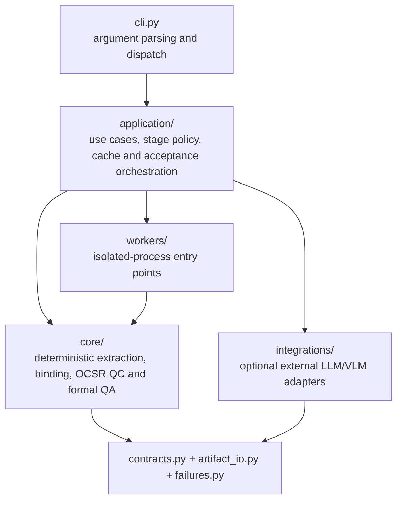
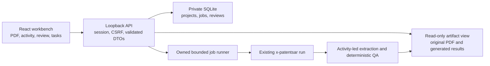

# Architecture

## Product boundary

X-PatentSAR is a standalone Linux/WSL application. Its command-line boundary is `x-patentsar` plus documented filesystem inputs, configuration and outputs. It has no runtime dependency on Synon processes, APIs, plugin registries or user workspaces. The new Web presentation layer uses the same application/CLI pipeline; it does not add another extraction engine.

Only `x-patentsar run` produces a formal activity-led result. Commands labelled as diagnostic may inspect or generate intermediate material, but their outputs cannot satisfy formal binding, SMILES or QA gates. Manual Web reviews are separately persisted annotations and cannot change generated extraction artifacts or acceptance.

## Layer ownership



Dependency direction is enforced by tests: `core/` does not import `application/`, `integrations/`, or the removed `orchestration/` package. External model configuration and HTTP calls live under `integrations/`; the CLI contains presentation logic only.

```text
src/patent_sar_extractor/
  cli.py                   command-line presentation
  application/             application use cases and QA policy
  core/                    deterministic domain and extraction engines
    series_table_binding.py typed I-series geometry/evidence resolution
    ocsr/                   DECIMER-only recognition, cache and RDKit QC
  integrations/llm/        optional LLM advisory QA and VLM adapter
  workers/                 isolated Python-process entry points
  defaults/                immutable packaged configuration
  contracts.py             product, pipeline, ruleset and schema authority
  artifact_io.py           atomic JSON read/write boundary
  failures.py              single strict-failure marker authority
  smiles_artifact.py       canonical SMILES artifact envelope
```

## Web presentation and state



The UI never reads local paths directly or runs extraction code. The API validates
uploaded originals, renders bounded pages and reads canonical artifact identity
envelopes. Jobs invoke the existing CLI in one owned process group. SQLite review
annotations are separate from extraction artifacts; there is no manual path to
change binding/SMILES/QA files or declare a failed run formally accepted.

`frontend/dist` is build output. The controller-owned packaging tool verifies and
copies it into the wheel's private package static directory. The installed wheel
serves both UI and API from one origin; Node.js is a build dependency only.

## Formal data flow

Every numbered page remains in original-PDF coordinates. The production chain never switches to a truncated PDF.

```mermaid
flowchart LR
    PDF["Original patent PDF"] --> C["1. Deterministic classify<br/>OCR cache + page classes"]
    C --> A["2. Activity extraction<br/>authoritative compounds and order"]
    A --> L["3. Structure-page locator<br/>active compounds only"]
    C --> L
    L --> S["4. DECIMER segmentation<br/>confirmed locator pages only"]
    S --> B["5. Structure binding<br/>visual evidence + activity order"]
    A --> B
    B --> O["6. DECIMER OCSR<br/>RDKit and chemistry QC"]
    O --> E["7. Excel and SDF export"]
    A --> E
    E --> DQ["8. Deterministic QA<br/>sole formal acceptance authority"]
    DQ -->|"acceptance.ok=true"| ACCEPT["Accepted deliverables"]
    DQ -->|"strict failure"| REJECT["STRICT_ACCEPTANCE_FAILED.json"]
    DQ -. "metrics only" .-> LLM["Optional LLM advisory QA"]
    LLM -.-> ADVICE["llm_qa_report.json / .md"]
```



The optional LLM report can suggest review but cannot promote, veto or mutate formal acceptance. Missing credentials produce an explicit `skipped_no_credentials` advisory artifact and do not degrade deterministic execution.

## Formal versus diagnostic paths

| Surface | Role | Formal-output authority |
|---|---|---|
| `run` | Complete activity-led pipeline | Yes, only when deterministic `acceptance.ok=true` |
| `classify`, `activity`, `smiles`, `qa` | Stage-level tools using current contracts | No by themselves |
| `excerpt`, `validate`, `score` | Diagnostics and operator investigation | No |
| `excerpt` output | Optional review PDF | Never consumed by the formal chain |

The ambiguous standalone `profile` and `bind` CLI paths are not exposed. Production bindings are tagged `execution_mode=production_activity_led`; production SMILES are tagged `execution_mode=production_decimer`.

## Artifact and failure contracts

Formal JSON artifacts carry the same identity envelope:

```json
{
  "schema": {"name": "patentsar.bindings", "version": 2},
  "product": {"name": "X-PatentSAR", "version": "0.1.0"},
  "pipeline_contract": {"name": "patentsar.activity-led", "version": "2.0.0"},
  "ruleset": {"name": "patentsar.accuracy-first", "version": "2.0.1"}
}
```

`smiles_results.json` is a versioned object with a `records` array; an unversioned bare list is not a reusable formal artifact. Cache reuse requires exact identity plus PDF, dependency and parameter fingerprints.

All fail-closed stages use one marker name and one writer: `STRICT_ACCEPTANCE_FAILED.json`. A successful formal QA clears that marker. There are no stage-specific failure filenames with conflicting meanings.

## Version model

| Identifier | Current value | Change trigger |
|---|---:|---|
| Product | `0.1.0` | User-visible software release |
| Pipeline contract | `patentsar.activity-led` `2.0.0` | Stage order or cross-stage semantics |
| Ruleset | `patentsar.accuracy-first` `2.0.1` | Acceptance or binding behavior |
| Artifact/cache schema | Namespaced integer versions | Serialized shape or cache compatibility |

Current non-default schema revisions are page classification v2 (`candidate_pages` replaces the ambiguous `core_pages` field), bindings v2 and formal QA v2. The diagnostic review-excerpt metadata starts at v1. All other current artifact/cache schemas are v1.

`contracts.py` is the only authority. Pipeline contract 2.0 removes the unused core-PDF branch and hidden worker profiling. Ruleset 2.0 makes deterministic QA the sole acceptance authority and explicitly separates diagnostic output. Ruleset 2.0.1 fixes spatial duplicate handling and strengthens ambiguity rejection; it invalidates old rule-dependent stage fingerprints without changing the product version or serialized schemas.

### I-series structure-table evidence

`core/series_table_binding.py` owns the pure geometry/number-resolution rule; `structure_binder.py` calls it and serializes its typed evidence. OCR repeats within two PDF points of the same number are deduplicated, but the same printed number at a different row is preserved. Pairing requires mutually unique nearest geometry; ties, nonfinite or inverted boxes are withheld. Missing segmentation cannot shift later rows.

Shared page-cache extraction uses one `_page_payload` path for sequential and threaded builds/updates. Scanned RapidOCR/PaddleX pages store text and coordinates from the same inference, even when text is long. Native text pages skip OCR engine startup. Explicit text-only OCR backends do not fabricate coordinates.

Step-cache reuse validates both the current manifest identity envelope and its content fingerprint, including classification. An unchanged classification fingerprint cannot bypass a ruleset change and retain an old text-only OCR cache.

A printed-number correction requires a duplicated source ID, unique immediately adjacent observed anchors proving one missing integer, that integer in the activity set, and no occurrence of that integer anywhere else in the observed table. Anchors may cross an adjacent observed page boundary, but not a missing page. Original printed ID, coordinates, inferred ID and correction reason remain explicit. Unresolved duplicates, including unsegmented competing rows, are withheld. I-series coordinate pairing works independently on observed table pages even when the locator page list is discontinuous; only the numeric global-sequence rule requires a contiguous full table. Recognized I-series tables cannot fall through to that numeric rule when geometry is ambiguous.

## Removed ambiguous paths

- Automatic `core.pdf` generation: removed because downstream stages always used the original PDF and page indices could not safely cross documents.
- LLM page reclassification: removed because it could non-deterministically mutate page ownership and previously dropped the classification identity envelope.
- LLM writes to `final_qa_report.md`: replaced by separate `llm_qa_report.*` artifacts.
- LLM veto of deterministic acceptance: removed; advisory warnings are audit information only.
- Worker-side `PatentProfiler` fallback: removed; structure extraction accepts only locator-confirmed pages.
- Automatic repair recursion: removed because strict default gates aborted before most repair triggers and output invalidation was not a trustworthy recovery protocol.
- MolNexTR/MolVec fallback adapters: removed; production and stage-level OCSR are DECIMER-only.
- Bare SMILES JSON and `SMILES_ACCEPTANCE_FAILED.json`: replaced by the canonical SMILES envelope and single strict-failure marker.

## Runtime boundaries

The application uses locked CPython 3.12 dependencies. DECIMER runs as an isolated CPython 3.10 subprocess because its TensorFlow constraints do not support the application runtime. Child processes discard the parent's `PYTHONPATH` and append only the PatentSAR source/package root after the child environment's own site-packages.

Packaged defaults are immutable. Operator configuration belongs under `PATENTSAR_CONFIG_DIR` or the XDG config directory; run data belongs under an explicit output path, `PATENTSAR_STATE_DIR`, or the XDG state directory. No installed wheel writes into `site-packages`.

## Invariants

- Activity rows define the authoritative final-compound set and order.
- Production structure segmentation uses only locator-confirmed original-PDF pages.
- Final bindings are unique, current-version, strongly confirmed and production-tagged.
- Production OCSR is DECIMER-only; every accepted SMILES passes RDKit, query-atom and suspicious-element checks.
- A formal result requires `final_qa_report.json` with `acceptance.ok=true`.
- LLM/VLM responses are untrusted optional inputs and never control formal acceptance.
- A cache is reusable only when schema identity, PDF identity, dependencies and parameters match exactly.
